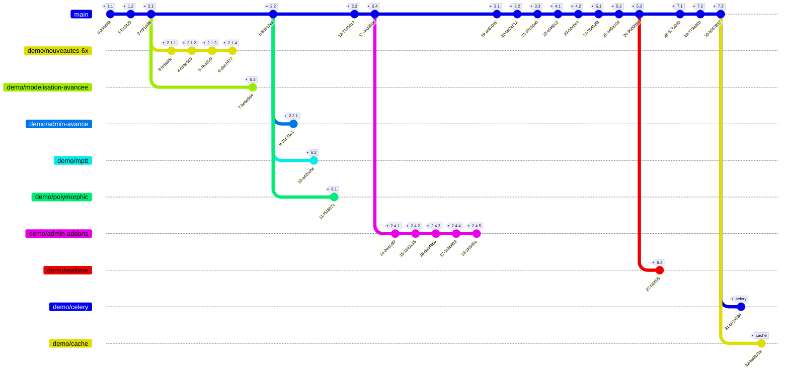

# taskflow — application fil rouge (formation Django, Dawan)

Application de **suivi d'avancement de tâches**, support pédagogique construit
pas à pas. Django 6.1, PostgreSQL, front htmx + îlots Vue/Vite, API Django-Ninja.

> Application « propre » (bonnes pratiques), par contraste avec `auditflow`
> (l'application volontairement vulnérable auditée au jour 4).

## Démarrage rapide (dev, SQLite)

```bash
python3 -m venv .venv && . .venv/bin/activate
pip install -r requirements-dev.txt
python manage.py migrate
python manage.py runserver
```

## Développement local (services via Docker, Django sur l'hôte)

Django s'installe et se lance **en local** ; Docker ne fournit que les services :
**PostgreSQL 18**, **Mailpit** (SMTP de dev + interface web), **Redis**
(+ **RedisInsight**, son visualiseur web), **Adminer**.

```bash
docker compose up -d          # postgres / mailpit / redis / adminer / redisinsight
cp .env.example .env          # DB_ENGINE=postgres, e-mail vers Mailpit
python manage.py migrate && python manage.py seed_demo && python manage.py seed_geo
python manage.py runserver
```

- Mailpit (e-mails capturés, dont la fiche PDF envoyée en tâche de fond) : http://localhost:8025
- Adminer (inspection de la base) : http://localhost:8080
- RedisInsight (visualisation du cache Redis) : http://localhost:5540

> Procédure d'installation détaillée et guide des interfaces (Mailpit, Adminer,
> RedisInsight) : voir le PDF *Environnement de développement local* fourni par le formateur.

## Convention de commits et de tags

Chaque **étape** et **sous-étape** de construction donne lieu à un commit et à un
tag numéroté `etape-X.Y` (X = phase, Y = sous-étape). Les **branches de démo**
partent du tag approprié et n'ajoutent que leur fonctionnalité, sans reprendre la
suite de `main`.

Naviguer dans les étapes :

```bash
git tag -n                       # lister les étapes et leur description
git switch --detach etape-2.2    # aller voir une étape (lecture seule)
git switch -c essai etape-2.2    # repartir d'une étape sur une branche
git switch main                  # revenir au fil principal
```

## Carte du dépôt (branches et étapes)



## Étapes de `main` (tags)

| Phase | Tag | Contenu |
|-------|-----|---------|
| **1 — Mise en place** | `etape-1.1` | squelette Django 6.1, configuration, dépendances, home + auth |
| | `etape-1.2` | Docker et docker-compose (PostgreSQL, MySQL, Mailpit, Redis) |
| **2 — Modèles et admin** | `etape-2.1` | modèles du domaine, enums, mixins, migration initiale |
| | `etape-2.2` | administration (IHM) — version de base, sans personnalisation |
| | `etape-2.3` | données de démonstration (commande `seed_demo`) |
| | `etape-2.4` | managers, querysets métier et clés naturelles |
| **3 — Validation, signaux, PDF** | `etape-3.1` | signaux (slug, fin réelle write-once, métriques) |
| | `etape-3.2` | export PDF de la fiche tâche (WeasyPrint) |
| | `etape-3.3` | génération PDF en tâche de fond (`django.tasks` 6.0) |
| **4 — API et front htmx** | `etape-4.1` | API Django-Ninja (tableau Kanban + déplacement) |
| | `etape-4.2` | front htmx (recherche live, statut inline, champs dépendants, formset) |
| **5 — Front moderne** | `etape-5.1` | cascade géographique htmx (cities-light) |
| | `etape-5.2` | autocomplétion ville côté serveur (Ninja) |
| | `etape-5.3` | îlots Vue + Vite (Kanban, cascade) + Tom Select |
| **7 — Tests et finitions** | `etape-7.1` | tests (pytest-django + pytest-bdd + pyhamcrest) |
| | `etape-7.2` | notes techniques + récapitulatif des branches (ce README) |
| | `etape-7.3` | ne pas versionner `node_modules` |

> La **phase 6** (démos avancées) et les sous-étapes `2.x.y` vivent sur des
> **branches** `demo/*` (voir ci-dessous), pas sur `main`.

## Branches de démonstration

Chacune part d'un tag et n'ajoute que sa fonctionnalité (sans la suite de `main`).
La colonne *Runtime* indique les dépendances/services à installer pour l'exécuter.

| Branche | Part de | Tags | Contenu | Runtime |
|---------|---------|------|---------|---------|
| `main` | — | `etape-1.1` → `etape-7.3` | application complète | PostgreSQL pour `delay` |
| `demo/nouveautes-6x` | `etape-2.1` | `2.1.1`–`2.1.4` | nouveautés Django 5.0→5.2 : `db_default`, `CheckConstraint`, index composite/partiel, `CompositePrimaryKey` | — |
| `demo/modelisation-avancee` | `etape-2.1` | `6.3` | enums riches + champs supplémentaires (ArrayField, DateRange) | PostgreSQL |
| `demo/admin-avance` | `etape-2.2` | `2.2.1` | admin avancé : visibilité métier (owner/équipe) + fieldsets sur-mesure (plusieurs champs par ligne) | — |
| `demo/mptt` | `etape-2.2` | `6.2` | arbre tâches / sous-tâches + admin MPTT | `django-mptt` |
| `demo/polymorphic` | `etape-2.2` | `6.1` | Task polymorphe (Anomaly / Action / Improvement) + admin polymorphe | `django-polymorphic` |
| `demo/admin-addons` | `etape-2.4` | `2.4.1`–`2.4.5` | add-ons admin : filtre déroulant projet, tri glisser-déposer, import/export CSV, filtre plage de dates, filtre multi-sélection | 5 paquets admin |
| `demo/realtime` | `etape-5.3` | `6.4` | Kanban temps réel (Django Channels) | serveur ASGI (`daphne`) |
| `demo/celery` | `main` | `etape-celery` | notification e-mail asynchrone du *owner* à la création d'un projet (signal → tâche Celery) | `celery` + Redis + worker |
| `demo/cache` | `main` | `etape-cache` | trois stratégies de cache Redis (bas niveau, fragment de template, page entière) sur deux bases Redis distinctes | `django-redis` + Redis |

> Une vue synthétique (diagramme + explication de chaque branche et tag) est
> fournie dans l'annexe PDF *Architecture du fil rouge* (`docs/architecture-fil-rouge.pdf`).

## Notes techniques

- **`delay` (GeneratedField)** a une **sémantique PostgreSQL** (soustraction
  date/heure) : sous SQLite (dev rapide) il vaut `0`. Utiliser PostgreSQL (docker)
  pour la valeur exacte. Bon exemple de fonctionnalité spécifique au moteur.
- **Front Vue** : `cd frontend && npm install && npm run build` (servi via
  django-vite en mode manifest). Dev avec HMR : `VITE_DEV=true` + `npm run dev`.
- **Géo** : `manage.py seed_geo` (petit jeu FR/US pour la démo) ; pour le volume
  réel (autocomplétion sur gros dataset) : `manage.py cities_light` (téléchargement
  geonames, restreint à FR+US par les settings).
- **Tests** : `pytest` (SQLite).
